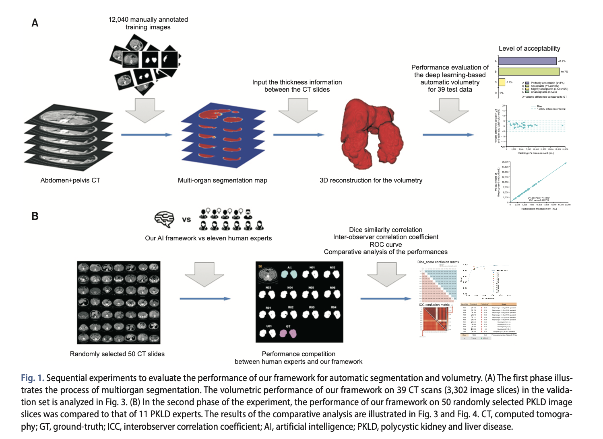
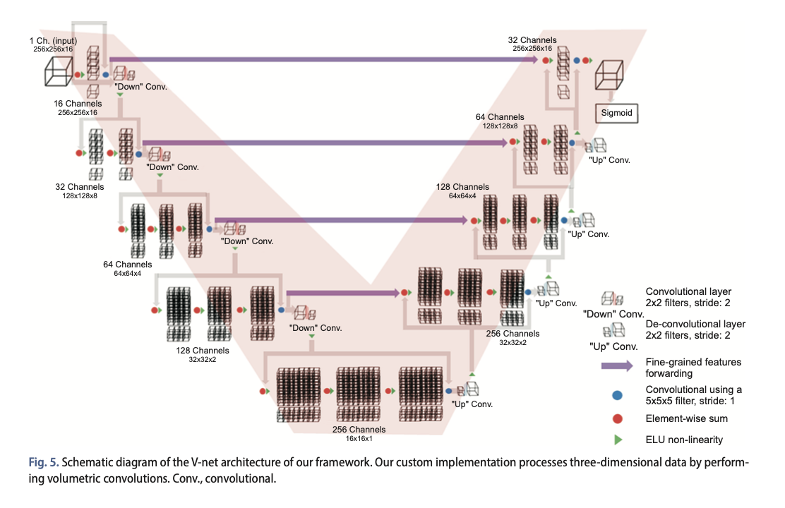
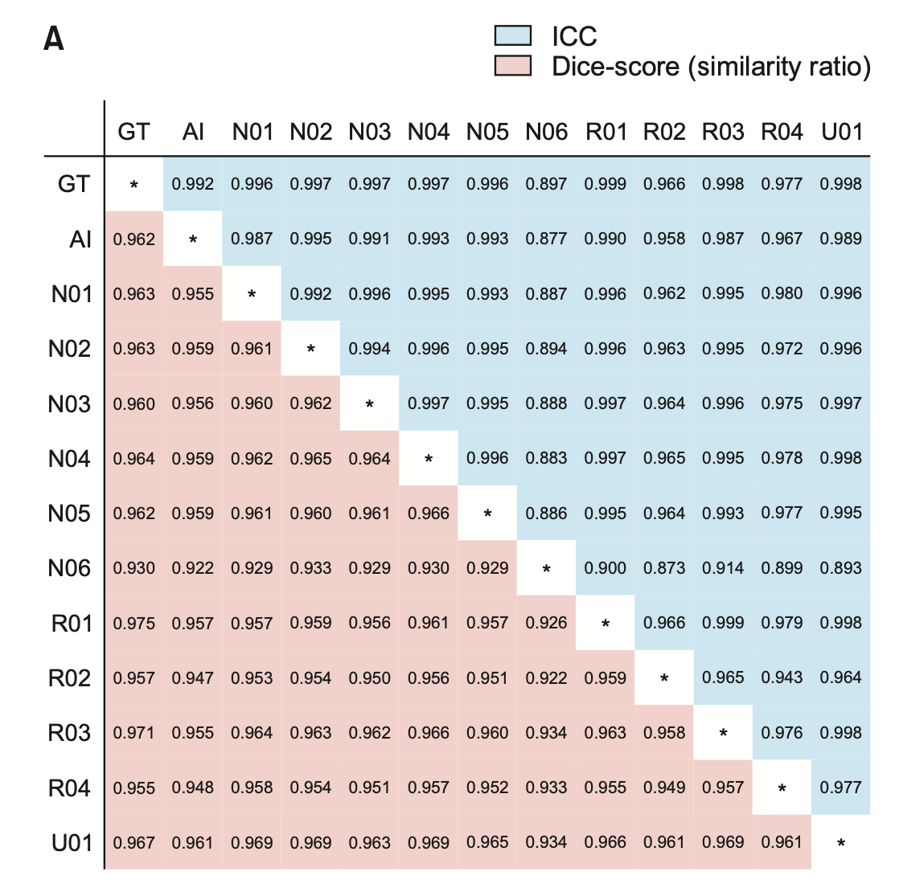
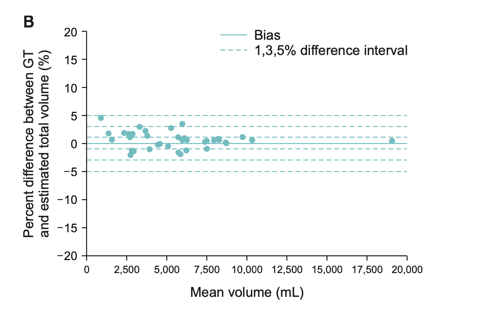
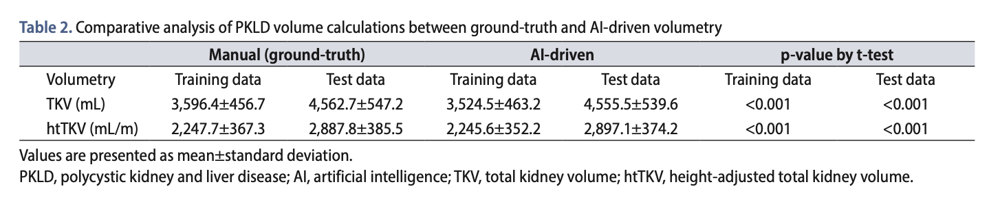
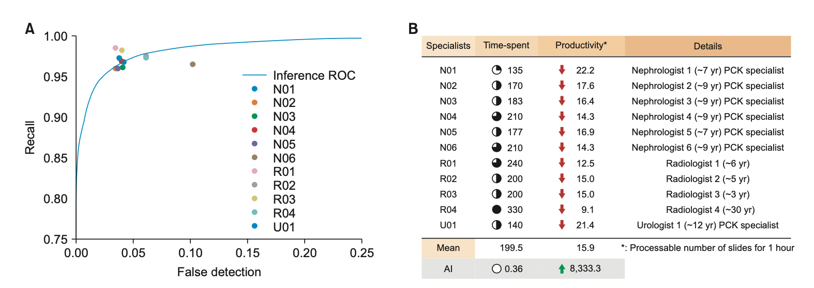

## Abstract

ADPKD Volumetry 는 **Polycystic kidney and liver diseases (PKLDs)** 에 대한 질환 진행정도, 약물 효율성 등을 판단하는데 중요한 역할을 합니다. 이러한 목적에서 이 논문은 Deep learning 을 활용하여 **CT 영상에서 ADPKD Segmentation** 을 수행하는 모델 (V-Net) 을 개발하여 **Dice Coefficient 0.96** 을 달성하였습니다. 이는 Medical Professional 의 segmentation performance 와 비교해도 준수한 성능을 보여 **실제 임상에서 활용되기에도 적합**하다고 이 논문은 제시하고 있습니다.

## Introduction

Autosomal Dominant Polycystic Kidney Disease (ADPKD) 는 가장 흔한 신장 질환이며 60 세 이상의 ADPKD 환자 중 50% 는 말기신부전으로 이어진다는 연구결과가 있습니다. ADPKD 를 진단하는데에 신장과 간의 Volumetry 는 severity 를 측정하는데 가장 중요한 biomarker 입니다. 

관련 연구들에서 CT, MRI 영상에서 각 slice 별로 manual-annotation 을 진행하여 Volumetry 시도가 많았습니다. 하지만 manual Volumetry 가 굉장히 노동 집약적이고 데이터를 재생산하는 것은 굉장히 비효율적입니다. 더 나아가 이러한 Volumetry 를 통해 학문적 진보를 이뤄내기 위해서는 많은 데이터가 필요한데, 현실적으로는 volumetric data 를 얻는 것어렵습니다. 이러한 문제점은 또 다른 문제들을 야기합니다.

1. 만약 Volumetry 가 disease severity 를 측정하는 중요한 biomarker 라면, 수학적으로 검증되어야 합니다. 하지만 현실적으로 Volumetric data 가 너무 귀하여 inter-, intraobserver variability 를 통계적으로 검증하여 human error 를 극복할 수 밖에 없으며 각 Volume 을 검증할 방법이 없습니다.
2. Severe liver volumetry 를 위해 데이터를 얻어내는 것 자체가 어렵기 때문에 질병 진행 정도에 대한 측정이나 Polycystic liver disease 를 치료에 대한 방법이 제한적일 수 밖에 없습니다.

이러한 이유에서 deep learning 을 활용한 automatic segmentation 모델을 개발하여 성능을 검증하는 연구를 진행하게 되었다고 논문에서 말하고 있습니다.

---

## Materials and Methods

실험은 총 2개의 phase 로 진행되었습니다.

1. **1st phase**: 서로 다른 5개의 병원 (7개의 CT scanners) 에서 총 175 case 에 대한 학습한 뒤, 39개의 test dataset 에서 liver, kidney volume 에 대한 정확도를 측정하였습니다. 이 때, ground-truth (GT) 와 deep-learning based automatic segmentation 의 결과로 나온 두 가지 volumetric data 에 대한 agreement 측정을 위해 Bland-Altman analysis 와 interobserver correlation (ICC) 을 측정하였습니다.
2. **2nd phase**: Automatic segmentation model 에서 나온 volumetric data 와 11명의 PKLD experts 가 측정한데이터를 비교하였습니다. 50 장의 image slice 를 무작위로 샘플링 하여 test 하였습니다. 이 실험을 통해 본 논문에서 개발한 deep learning model 이 human disadvantage 를 극복할 수 있는지에 대해 검증하였습니다.

### Dataset

1. 214 명의 ADPKD 환자에서 Axial CT images 를 얻었고, 이 중에서 80% (175 cases) 를 training dataset 으로, 20% 를 validation set 으로 구성하였습니다. 각 환자의 CT 영상은 slice 갯수가 29~256 으로 서로 달랐습니다. 
2. 총 Axial image 의 갯수는 **12,040 장**이며, 그 중 **target organ 이 있는 장수는 3,302 장** 입니다.

### Convolutional neural network architecture

1. CNN 기반의 V-Net 을 활용하여 pixel 단위로 segmentation 하는 모델을 개발하였습니다. 하지만, 원래 V-Net 과는 다르게 총 16장의 image slice 가 묶인 chunk 3D CT image 를 input 으로 넣었고 각 pixel 에서 activation function 은 Softmax 대신 Sigmoid function 을 사용하였습니다. 안정적이고 빠른 학습을 위해 매 Convolution layer 에 Batch normalization 을 추가하여 학습하였습니다. 

### The Training process of our model

1. Overfitting 과 model 의 good generalization 을 위해 3가지 서로 다른 data augmentation 방법을 사용하였습니다. (약 80%의 확률로)
   - Random Crop
   - Random Scale
   - Cutout augmentation
2. Training case 에서 연속된 16 장의 slice 를 input 으로 설정했고, batch size 는 8 로 학습을 진행했습니다.
3. Sigmoid 함수를 활용하여 특정 threshold 이상의 확률을 갖는 pixel 은 foreground, 나머지는 background 로 예측 결과를 조정하였습니다. 이 때, threshold 는 ROC space 에서 operating point 를 찾았으며 이를 기반으로 precision, recall 그리고 dice score 를 계산하였습니다.

### Statistical analyses

1. 본 논문에서 개발한 Automated segmentation method 의 성능을 평가하기 위해 DSC 를 사용하였으며 이는 예측된 결과 영상과 실제 manual segmentation label 과의 spatial overlap 을 측정하는 지표입니다.
2. 그리고 manual segmentation label 과 predicted segmentation output 사이의 absolute, relative difference 를 측정하기 위해 Bland-Altman plot 을 그렸습니다.

## Results

### Phase 1: Volume Calculation accuracy

1. 위의 그림에서 볼 수 있듯이 본 논문에서 개발된 **automated segmentation model 의 성능은 DSC 0.961 그리고 ICC 0.999729 (p < 0.00001)** 입니다. 
2. Bland-Altman plot 에서도 확인할 수 있듯이 GT volume 과 estimated volume 사이의 difference 가 통계적으로 유의미 하게 작다는 것을 알 수 있습니다.

### Phase 2: Comparison of segmentation performance with human experts

1. 최소 3년 이상의 경력을 가진 medical professional 11명이 무작위로 선택된 50장의 image slice 를 annotation 한 뒤 이를 estimated output 과 성능을 비교하였습니다.
2. 결과를 보면, 이 모델의 성능은 총 10명의 specialist 들의 평균과 비슷했습니다. N06 specialist 는 outlier 였으며 이에 대한 원인은 annotated photograph 가 적절하지 않게 process 되었다는 것으로 짐작했습니다.
3. Expert-level performance 를 보이는 것 외에도 이렇게 개발된 모델은 한 시간에 약 8,333.3 장의 영상을 segmentation 할 수 있었고 이는 시간당 평균 15.9 장을 segmentation 하는 medical expert 의 약 500배 정도 빠릅니다.

## Discussions

본 논문은 이러한 실험 결과 및 디자인을 통해 다음과 같은 사항들을 기술하였습니다.

1. 만약 deep-learning 기반의 automatic segmentation 모델이 계속해서 좋은 성능을 보인다면, 이는 사람이 volumetry 측정시에 갖고 있는 human factor 를 극복할 수 있는 가능성이 있다고 말하고 있습니다. 
2. 더 나아가 deep-learning 기반의 automatic segmentation 모델은 intra-, interobserver variability 를 줄이는데 도움을 주며 intractable diseae 에 대한 적절한 therapeutic agent 의 평가 및 개발에 기여할 수 있다는 의미가 있습니다.
3. Total Liver Volume, Total Kidney Volume 들이 효과적인 biomarker 가 되기 때문에 Malnutrition, abdominal symptom 과 연관이 있는 Total Abdominal Volume (TAV) 를 사용하여 학습했습니다.
4. CT 영상을 획득할 때 주로 조영제를 넣고 촬영을 하게 되는데 이로 인해 Kidney, Liver 의 영상이 평소와 다르게 보일 수 있습니다. 하지만, 본 논문에서 사용한 데이터는 85% 이상의 데이터가 (182/214) non-contrast CT 영상이었으며 deep-learning segmentation model 은 이러한 케이스에 대해서 더 높은 성능을 보인 것을 알 수 있었습니다.

## Conclusion

1. Polycystic Kidney Liver Disease 에서 deep-learning based segmentation model 은 사람에 비해 월등히 빠른 속도로 segmentation 을 할 수 있습니다.
2. 더 나아가, 이렇게 개발된 모델의 성능이 human-performance 에 비해 뒤지지 않아 실제 임상 환경에서 효과적으로 사용될 수 있음을 시사하고 있습니다.