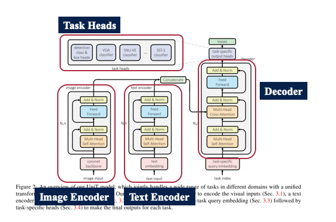
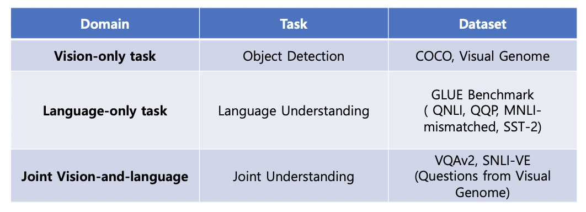
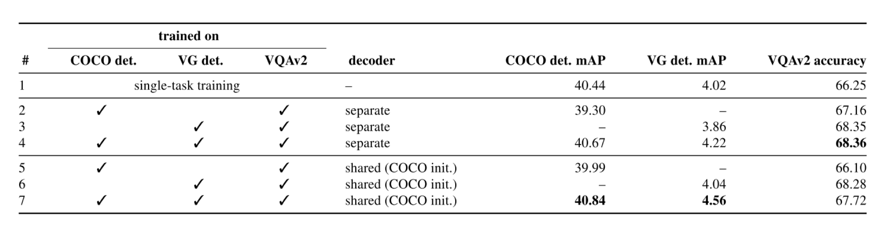
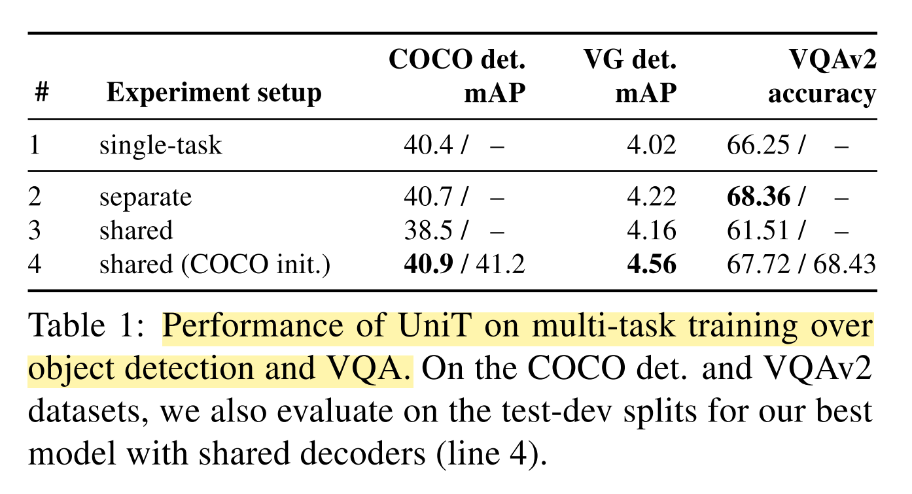
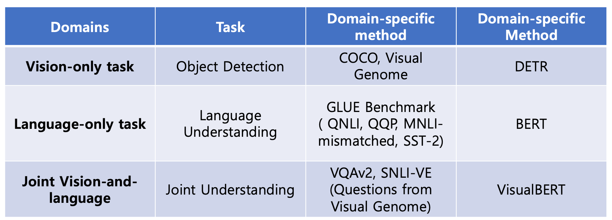
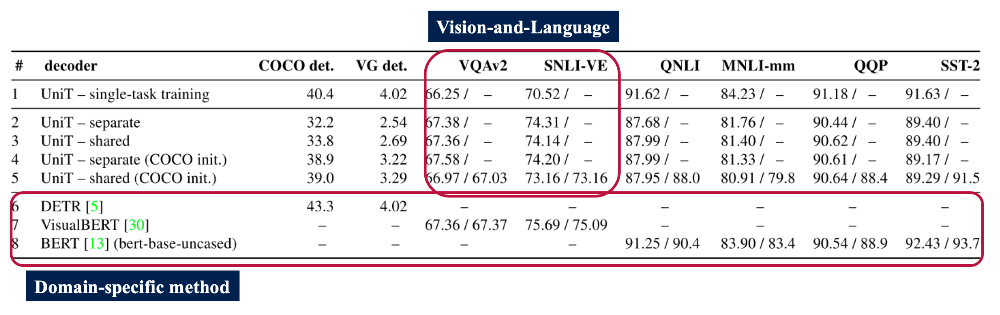

## Abstract

이번 주에 소개해드릴 논문은 Facebook AI Research 그룹에서 발표한 Transformer is All You Need: Multimodal Multitask Learning with a Unified Transformer 입니다. 본 논문에서는 기존에 Multi-modal 데이터셋에서 잘 학습이 되고 동작하는 모델을 활용하여 UniT: Unified Transformer model 를 제안하였습니다. 저자들은 UniT 을 활용하여 multiple task 와 multi-modality 를 동시에 end-to-end 로 학습할 수 있는 방식을 제시하였습니다. 총 7가지 task 를 8가지 dataset 에서 실험하였으며 기존에 well-established 된 domain-specific method 와 비교해도 준수한 성능을 낼 수 있다는 점을 실험적으로 증명하였습니다.

## Introduction

Transformer 를 활용한 기존 연구들은 natural language, images, video 그리고 audio 와 같은 multi-modality dataset 에 대해서 성공적인 결과를 보였습니다. 더 나아가, Transformer 는 large corpora 에서 pre-train 된다면 그 뒤에 downstream language task 에 대해서도 더 잘 작동할 수 있다는 연구 결과도 밝혀져 왔습니다. 

게다가, Transformer 는 **Visual Question Answering** 과 같이 **vision-and-language reasoning tasks** 에서도 강력한 성능을 내는 것을 확인하는 연구 결과를 봤습니다.

하지만, 기존 연구에서는 Transformer 를 specific domain 에서만 활용했을 뿐이지, 여러가지 task 를 엮어서 활용한 연구 결과는 발표되지 않았습니다. 따라서 본 논문은 UniT 이라는 하나의 통합된 모델을 사용해서 동시에 여러가지 task 를 handle 할 수 있는 방식을 고안해내게 되었습니다. 특히 UniT 은 input 으로 image, text 를 받고 이를 통해 visual perception, language understanding 에 대한 정보를 뽑아낼 수 있게 합니다.

---

## Materials and Methods

UniT 은 총 4가지 파트로 구성이 되어 있습니다. Image Encoder, Text Encoder, Decoder, Task Heads 로 나눠져 있으며 각 부분에 대해서 자세하게 설명하도록 하겠습니다.

#### Image Encoder

Image Encoder 는 Image 를 먼저 Convolutional Neural Network 을 활용하여 Backbone network 를 통과하게 됩니다. 이 경우에 Visual Feature map 이 나오게 되고 이 map 을 활용하여 Image encoding 을 진행하게 됩니다. UniT 의 Encoder 에서 활용한 모델은 DETR [1] 에서 활용한 모델과 동일합니다. 여기서 나온 Image encoded hidden vector 를 다른 modality 데이터와 같이 Decoder 에 넣게 됩니다.

#### Text Encoder

Text Encoder 는 textual input 을 BERT 를 통과시켜 S 개의 token 을 만들어냅니다. BERT 는 Huggingface 에서 미리 학습된 모델을 활용했으며 이는 거대한 copora 로 부터 학습된 Transformer encoder 를 제공합니다. BERT 에 태우기 전에 먼저 text embedding 을 통과하여 tokenize 를 진행합니다. 최종으로 나온 hidden vector 가 추후에 image encoded hidden vector 와 같이 사용됩니다.

Image Encoder, Text Encoder 에 동시에 들어가는 벡터가 있는데 이는 task embedding vector 입니다. 여러가지 task 를 한 번에 학습하다 보니 task 에 대한 human guide 가 필요한데, 이를 위해 별도의 task indexing vector 를 넣었습니다. 다만, task embedding vector 의 삽입에 대한 여부도 hyper-parameter 로 남겨두어 추후에 ablation study 를 진행하고 성능 비교를 했습니다.

#### Decoder

UniT 에서 Decoder 는 가장 중요한 부분입니다. Domain-agnostic 하게 모든 task 에서 동일한 구조를 가지게 되며 이를 잘 학습시켜야 합니다. Multi-Head Cross Attention block 이 존재하는데, 여기에 직전 단계에서 encoding 된 image vector, text vector 를 단순히 concatenation 하여 input 으로 집어넣게 됩니다. 또 Decoder 의 input 으로 task-index 를 활용하여 task-specific query embedding 을 진행한 뒤 encoding 된 정보들을 활용하여 attention 을 진행하고 이를 최종 decoder 의 output 으로 활용합니다.

#### Task-specific output heads

Task-specific 한 prediction head 를 각 task 에 맞게 미리 설정해 놓은 뒤, 이를 활용하여 최종 prediction을 하게 됩니다. 하나의 예시로 object detection 에 대한 head 를 설명하자면, object detection 은 총 3가지 head 가 필요합니다. Class head, Box head 그리고 Attribute head 가 필요합니다. decoder 에서 나온 최종 output 을 각 head 에 넣게 되고 이를 활용하여 loss 를 계산하게 됩니다. Object detection task 의 경우에는 bounding box 형태로 output 이 나오게 되는데 마지막의 output 들을 post-processing 하여 구하게 됩니다.

학습시에는 각 L 개의 decoder layer 에서 계산을 하게 되고 prediction 을 하게 될 경우 decoder layer 중 가장 마지막 layer 만 활용하여 최종 output 을 내게 됩니다.

## Experiments

### Dataset

본 논문에서 UniT 을 학습하기 위해 총 7가지 task 에서 8가지 데이터셋을 활용하였고, 다음과 같이 dataset 을 구분하였습니다.

### Experiment Setting

총 2가지 방향으로 실험 setting 을 진행하였습니다.

#### Setting 1

첫 번째 Setting 은 Vision-Only task 그리고, Vision-and-Text task 를 비교하는 setting 입니다. 첫 번째 실험에서는 전체 데이터셋을 사용하지 않고, COCO 2017, Visual Genome Dataset, 그리고 VQAv2 dataset 을 활용하였습니다. 가장 중점적으로 Decoder sharing 여부를 놓고 비교실험을 진행했습니다.

1. Separate decoders on different tasks
2. A single shared decoder for all tasks

그리고 평가 지표로는 다음 두 가지를 사용하였습니다.

1. Mean Average Precision (mAP) : For object detection
2. VQA Accuracy

#### Setting 2

두 번째 setting 에서는 Language understanding tasks 과 추가적인 joint vision-and-language reasoning task를 활용하여 introduction 에서 소개한 UniT 모델을 학습하였다. Setting 1 과 마찬가지로 Decoder sharing 여부를 놓고 비교실험을 진행하였다.

1. Single-task training (each model is trained separately on each task)
2. Multi-task training with separate decoders
    (has a specific decoder for each task but is jointly trained on all of the tasks)
3. Multi-task training with a shared decoder

## Results

#### Setting 1

먼저 첫 번째 실험결과를 보겠습니다. 첫 번째 실험에서는 총 3가지 지표로 평가를 했습니다. Object detection 과 Vision-and-Text task 에 대해서 UniT 에 대한 학습 및 평가를 진행했습니다.

1. COCO detection mAP
2. Visual Genome detection mAP
3. VQAv2 accuracy

#### Setting 2

두 번째 실험에서는 총 7개의 task, 8개의 dataset 에서 실험을 진행했고 이에 대한 실험 결과는 아래 표와 같습니다. 각 Domain 에 해당하는 task 에 대해서 domain-specific method 와의 비교 실험도 진행했습니다.

대부분의 domain 에서 Vision-and-Language 파트를 제외하고는 UniT 에 single-task training 을 하는 것 보다 multi-domain 으로 학습한 모델의 성능이 더 떨어집니다. 결과에 대한 분석은 Discussion 파트에서 주로 다루겠지만, cross-domain overlap 을 극복하지 못하고, vision and text information 을 joint 하게 사용하지 않고 단순히 concatenation 해서 학습했다는 점이 약점으로 작용할 수 있습니다. 

## Discussions

#### Separately trained model (single-task) 가 multi-modal 보다 좋은 성능을 보이는 이유

1. Unimodal task 가 더 적은 cross-modality overlay 를 갖고 있기 때문에 학습 성능이 더 좋을 수 밖에 없다는 점을 설명했습니다.
2. 또한 각 task 가 전체 500k iteration 단위로 학습을 진행하였는데, multi-task 로 학습하게 될 경우 single-task learning 에 비해 각 학습에서 적은 비율의 iteration (i.e., 적은 수의 반복 학습) 을 진행하기 때문에 성능이 좋지 않다고 말을 합니다.
3. 하지만, Shared decoder 를 사용하게 될 경우 기존의 unimodal task 의 경우에는 각 모델과 도메인에 맞는 각각의 모델이 학습되기 때문에, 이를 하나의 모델인 UniT 으로 학습하게 되면 대략 8배 가량 적은 parameter 를 활용하여 준수한 성능의 모델을 학습할 수 있다고 합니다.

#### Vision-and-language task 가 UniT 에서 좋은 성능을 보이는 이유

1. UniT 은 multi-modal dataset 을 활용하여 학습을 진행합니다. 이렇게 될 경우 앞서 언급한 cross-modality overlay 때문에 각각의 도메인에 맞는 task 에 비해 성능이 하락할 수 있습니다. 하지만 반대로 생각하게 되면 두 도메인이 겹치는 부분에서의 task 의 경우에는 UniT 를 활용하면 성능이 더욱 올라갈 수 있습니다. 따라서 VQAv2, SNLI-VE dataset 과 같은 경우에는 (Vision-and-Language task) 

## Conclusion

1. 본 논문에서는 **Transformer framework** 가 **multiple domains, multiple tasks** 로 학습이 될 수 있는 부분이 있으며 특히 본 논문에서 제시하는 **UniT** 은 이를 현실화 할 수 있는 방법을 제시하였다.
2. UniT 은 동시에 7개의 task, 8개의 dataset 을 학습하였으며 이는 domain-specific 한 모델과 비교했을 때에도 준수한 성능을 보인다.
3. Domain-agnostic 한 Transformer 구조를 개발함으로써 General-purpose intelligence agents 로 한단계 더 나아가는 모양을 보일 수 있었다.

