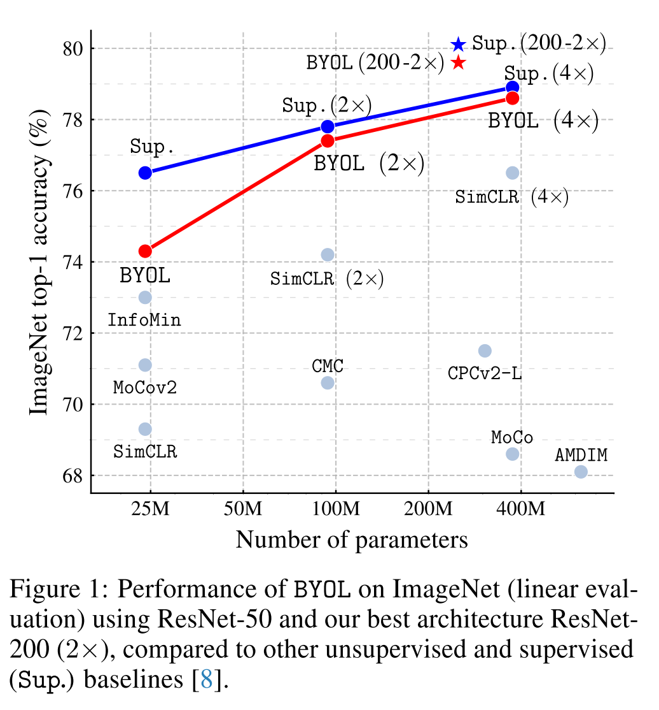
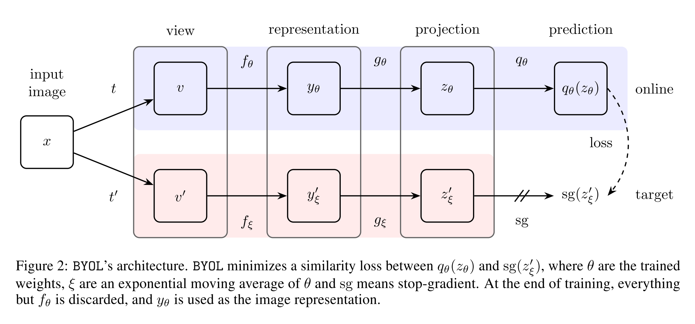
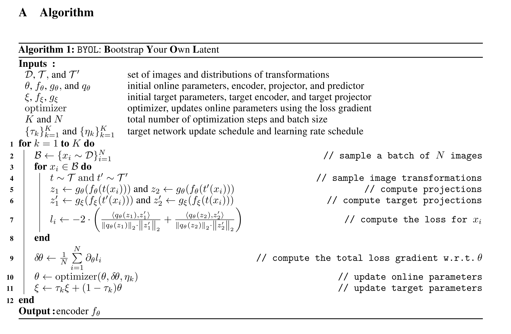
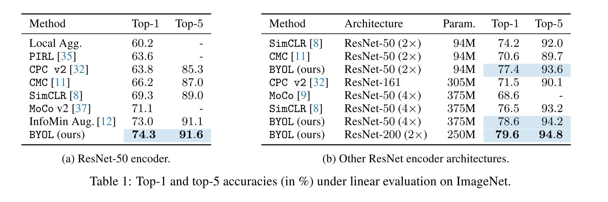
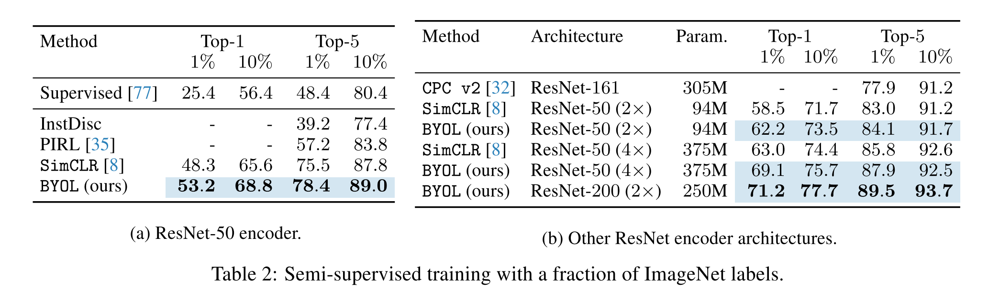
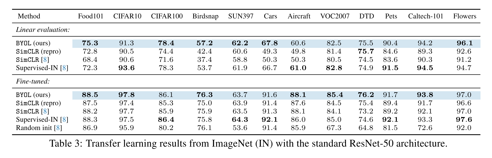
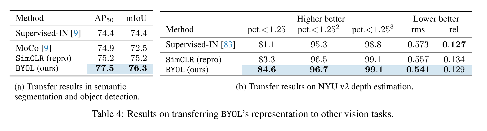

**Bootstrap Your Own Latent 논문은 deepmind 에서 2020 Neurips 에 발표한 논문입니다.**

## Abstract

본 논문은 **B**ootstrap **Y**our **O**wn **L**atent (BYOL) 라는 새로운 self-supervised representation learning 을 제시합니다. BYOL 에는 online network, target network 총 2개의 Neural Network 이 존재하며 마치 기존 연구의 Teacher-Student network learning 방식과 비슷하게 두 개의 network 가 상호 보완적으로 학습합니다. 하나의 이미지에서 각각 서로 다른 augmentation 기법을 활용한 transformation 을 진행하고, online network 와 target network 에 모두 태우게 되는데, **이 때 online network 가 target network 의 label 이 아닌 representation 을 학습하는 방식으로 전체적인 learning process 가 구성**됩니다. 동시에 target network 를 **online network 의 slow-moving average 방식을 활용하여 업데이트** 하게 됩니다.

BYOL 의 가장 큰 장점은, 기존의 비슷한 contrastive learning 방식들과는 다르게 negative pair 을 사용하지 않고 기존 다른 방식들과 비슷한 성능을 보여줍니다. BYOL 은 ResNet-50 모델을 활용했을 때 ImageNet Top-1 accuracy 를 74.3% 달성 (linear evaluation) 했으며, larger ResNet 을 활용했을 때에는 79.6% 의 성능을 보여줍니다.

---

## Introduction

#### Self Supervised Learning

Self-supervised learning 은 기존 연구들에서도 보고된 바와 같이 input dataset 의 representation 을 학습하여 pretrain 된 모델을 활용하여 additional downstream (vision) task 에서 좋은 성능을 낼 수 있다고 알려져 있습니다. 최근에는 positive sample representation 과 negative sample representation 사이의 distance 를 멀게 하는 contrastive learning 방식을 활용한 self-supervised learning 방식이 도드라지고 있습니다. 

#### BYOL

본 논문에서 제시하는 BYOL 은 negative sample 을 제외하고도 기존 방식들 대비 높은 성능을 달성 할 수 있음을 보여줍니다. 이는 반복적으로 target representation 을 boostrapping 하여 enhanced representation 을 나타낼 수 있게 합니다. 더 나아가, BYOL 은 **image augmntation 의 선택에 상당히 robust** 한데, 저자들은 이 이유를 negative pair 를 사용하지 않기 때문이라고 말하고 있습니다. 

Negative pair 를 사용하지 않게 되면, 모든 영상들에서 같은 종류의 representation vector 를 추출하는 collapsing 을 야기할 수 있는데 본 논문에서는 다음과 같은 방식을 사용하여 collapsing 을 피했다고 하고 있습니다.

1. Online network 에 predictor 추가
2. Online network 의 slow-moving average 를 활용하여 target network 를 구성한 것

이 두개의 조합을 활용하여 online projection 에서 더 많은 정보를 encoding 하게 되어 collapsed solution 을 피할 수 있다고 합니다.

#### Contributions

Evaluation 은 ResNet 구조를 활용하여 BYOL 으로 ImageNet 을 학습했습니다. 본 논문의 contribution 은 다음과 같습니다.

1. Negative sample 을 사용하지 않는 새로운 Self-supervised learning 방식인 BYOL 을 제시했고, 이는 linear evaluation 을 했을 때 ImageNet 에서 기존 성능 대비 높은 성능을 보여줬습니다. 
2. 이렇게 학습된 representation 이 semi-supervised or transfer learning 에서도 높은 성능을 보여주었습니다
3. BYOL 방식은 batch size 와 image augmentation 의 변화에도 robust 하다는 것을 증명하였습니다
   

---

## Materials and Methods

---

## Experimental evaluation

#### Linear evaluation on ImageNet

#### Semi-supervised training on ImageNet

#### Transfer to other classification tasks

#### Transfer to other vision tasks

---

## Conclusion

1. 본 논문은 새로운 image representation 을 위한 self-supervised learning algorithm 을 고안했습니다. BYOL 은 negative pair 를 사용하지 않고 previous versions of its outputs 을 예측하면서 학습을 진행합니다. 
2. (논문이 쓰여질 당시 SOTA) ImageNet 에서 ResNet-50 을 기반으로 한 linear evaluation protocol 에서 SOTA 성능을 보여주었으며, ResNet-200 을 사용했을 때 기존 sota 모델 대비 30% 적은 수의 parameter 를 사용하고도 top-1 accuracy 79.6% 의 성능을 보여줬습니다. (기존 성능 76.8%)
3. 그럼에도 불구하고, BYOL 은 vision task 에서만 사용될 수 있는 augmentation 방식을 채택하고 있습니다. BYOL 이 일반적으로 사용될 수 있으려면 다른 modalities 들 (audio, video, text etc.) 에서도 통용되는 augmentation 방식들도 사용해볼 필요가 있습니다. 하지만 적절한 augmentation 방식들을 searching 하는 것은 많은 노력이 필요하기 때문에 이를 자동화 하여 augmentation 을 searching 하는 방식을 찾는 것이 중요하다고 말하고 있습니다.

