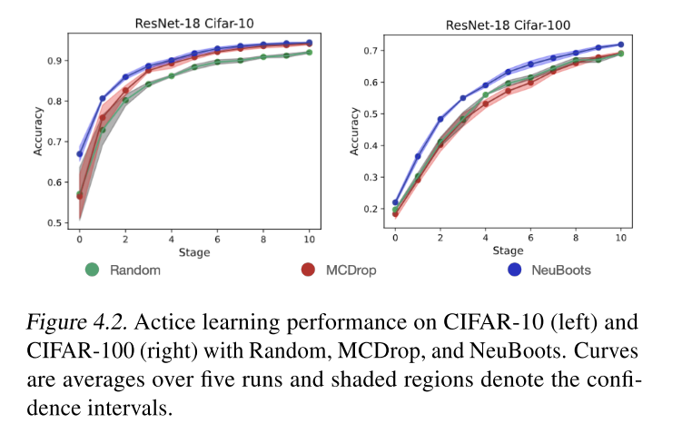

## Abstract

Bootstrapping 은 Uncertainty quantification 에 많이 사용되는 방식이었습니다. 하지만 기존 bootstrapping 방식은 반복되는 계산이 많기 때문에, Neural Network 를 학습시키는데에 computational cost 가 너무 높고 이러한 특성으로 인해 **Neural Network (특히 modern deep learning) 에서 실용적으로 사용되기에는 커다란 장애**가 됩니다. Computational bottleneck 을 해결하기 위해 본 논문의 저자들을 **Neural Bootstrapper (NeuBoots)** 라는 **generator of bootstrapped networks** 를 제안합니다.

일반적인 Bootstrapping 과는 다르게, **본 논문에서 제안하는 Neuboots 는 하나의 loss function 으로 단 한번의 학습을 통해 구현이 가능**합니다. 이런 방식을 통해 기존 bootstrapping 이 갖고 있던 반복 학습을 피할 수 있어 **bootstrap 계산의 효율성을 높일 수 있습니다**. 더 나아가 본 논문에서는 Neuboots 가 standard bootstrap distribution 을 asymptotically approximate 한다는 것을 이론적, 실험적으로 증명하였습니다. 

결과적으로 machine learning 에서 Neuboots 를 적용하여 **uncertainty quantification** 을 할 수 있으며 동시에 **calibration, semantic segmentation, out-of-distribution detection, 그리고 active learning 에도 사용할 수 있음**을 보여줍니다. 또한 Neuboots 는 적은 연산량으로 **state-of-the-art uncertainty quantification** 성능을 보여줍니다.

---

## Introduction

Bootstrap 이 1979 년에 소개된 이후로 이 기술은 uncertainty 을 측정하는 주요한 툴이 됐습니다. 예를 들어, standard error, confidence interval, hypothetical null distribution 등을 평가하는데 사용됐습니다. Statistics 분야에서 굉장히 많이 쓰임에도 불구하고, bootstrap 을 neural network application 에 활용하기에는 computational intensity 가 높아 주목받지 못했습니다. **Uncertainty 를 측정하기 위해서 bootstrap 은 적어도 수백 수천개의 모델을 평가해야 하는데, neural network 로는 computational cost 가 높아 실용적이지 못합니다.**

본 논문에서 소개하는 **Neural Bootstrap 은 deep neural network** 에서도 사용 가능하게 고안되었고, **generator function** 을 만들어 **bootstrap weight** 을 bootstrap sample 에 mapping 하게됩니다. 다시 말해, **Neuboots 는 Neural network 들의 bootstrap distribution 을 생성하게 고안**되었고 이를 활용하여 Convolutional neural network 에도 적용합니다. 

Neuboots 는 이미 존재하는 neural network 에 쉽게 적용 가능합니다. Bootstrap weights 를 입력으로 받는 generator function 을 구성하고, Neuboots 로 wrapping 된 neural network 은 target network 의 feature 와 bootstrap weights 를 입력값으로 받습니다. Application 단에서는 bootstrap generator 의 output 이 bootstrap weigths 와 last hidden-layer 의 hidden nodes 를 element-wise multiplication 으로 구성합니다. 이렇게 함으로서 Neuboots 를 활용하게 되면 **network parameters** 에 **randomness** 를 주지 않고 (보통 randomness 는 large-number 이고) **target network 의 bootstrap sample 을 바로 출력값으로 내게 됩니다.** 다시 말해, Neuboots 의 randomness 는 model parameter 의 randomness 가 아닌 input bootstrap weights 의 randomness 입니다.

본 논문에서는 Neuboots 가 이론적으로 valid bootstrap distribution 을 갖는 다는 것을 증명하였고. 처음에는 정확한 bootstrap distribution 을 구성하는 Vanilla NeuBoots 를 보여준 뒤, scalable approximation by considering **blocks of data observation** 을 고려한 block bootstrap 을 적용한 것도 보여줍니다. 

더 나아가 Neuboots 는 MCDrop, Deep Ensemble, Gaussian Process (GP) 와 같은 방식들에 비해 **학습과 추론 시간 모두 computationally efficient** 합니다. Neuboots 는 다수의 neural network 들을 학습하는 것이 아닌, **단 한번만 학습**하여 학습 효율적입니다. 또 **추론 시에도 randomly generated bootstrap weights 를 모델에 집어넣는 형식이 되어 효율적**입니다.

---

## Materials and Methods

### Neural Bootstrapper

#### Random Weight Bootstrapping (RWB)

- Non-parametric Bootstrapping 과는 다르게 observed data points 들을 충분히 이용합니다.
- Non-parametric Bootstrap 이 각 bootstrap evaluation 에서 **오로지 63% 의 observation 을 사용**한다는 것은 잘 알려진 사실입니다, 그 이유는 corresponding multinomal weight 가 몇몇 zero individual weight 를 야기하기 때문입니다.
- 하지만, RWB 의 **weight 는 continuous weight distribution** (the Dirichlet distribution) 으로 부터 generate 되기에 항상 non-zero 입니다. 이러한 이유로 RWB 에서는 observed data points 들이 bootstrap procedure 에 fully considered 됩니다. (이러한 이유로 본 논문에서도 Non-parametric bootstrap 보다 **RWB** 에 focus 합니다.)

#### Generative Extension of Bootstrapping

- Bootstrap sample 을 생성해내기 위해서는 모든 sample 들에 대해서 각 network 의 parameter 들을 저장했어야 합니다. 
- 하지만 본 논문에서 고안해낸 Neuboots 는 **block bootstrapping** 방식을 활용하여 전체 데이터셋을 n -> S 로 줄여서 그 내부에서 bootstrapping 을 진행했고 각각을 index function 으로 본래 weight 에 할당 (assignment ) 하여 Generator 를 뽑아냅니다.
- 결과적으로 본 논문에서 **Generator** 는 **bootstrap weight**, 즉 **alpha vector 를 target network 의 구조에 맞게** (architecture adaptive blocks) 로 뽑아내어 이를 **M_beta** 에 element-wise multiplication 하여 **F_theta** 에서 나온 penultimate layer 의 feature 들을 일정 수준 perturb 하게 됩니다.
- 이 때 중요한 것은, penultimate layer 의 semantic 한 feature 가 perturb 가 되었음에도 불구하고 classifier 가 여전히 좋은 (좋거나 더 높은) 성능으로 feature 들을 학습하는 것입니다. 여기서 alpha vector 의 역할을 알 수 있는데, alpha vector 는 penultimate layer 의 feature 들의 weight 에 attention 을 가해주는 것입니다. Alpha vector 가 삽입 되기 이전에는 penultimate layer 들의 feature 들에 전부 uniform 한 weight 가 곱해지게 됐는데 alpha vector 가 곱해지면서 perturbation 으로 인해 attention 이 들어가게 됩니다. 

- 본 논문에서 제시한 Neuboots 는 uncertainty estimation 을 기존의 bootstrap 과는 다르게 computational efficient 한 방향으로 bootstrap 결과와 같은 효과를 내게 됩니다. 이를 증명하기 위해 아래와 같은 figure 를 보여줍니다. Figure 3.2 에서 1, 2 열에 각각 Bootstrap, NeuBoots 에서 도출된 결과를 확인할 수 있습니다. 

  

## Empirical Studies

Neuboots 에 대한 실험적인 결과를 Uncertainty quantification 및 applications 들로 검증 및 분석했습니다. Application 은 Out-of-distribution (OOD) experiments, confidence estimation, active learning (image classification task), semantic segmentation task 에서 Neuboots 를 적용하였습니다.

### Out-of-Distribution Detection Experiments

#### Setting

- Neuboots 를 uncertatiny quantification 에서 중요한 OOD detection 에 적용했습니다. ResNet-34 모델을 활용하여 classification task (CIFAR-10) 을 학습하였고 model evaluation 을 위해서 test datase (CIFAR-10) 을 활용했습니다. 
- OOD detection 을 평가하기 위해 **SVHN dataset (OOD dataset)** 을 활용하여 평가했습니다. (**CIFAR-10 (in-dist) vs. SVHN (out-dist)**)

- Evaluation 할 때에는 confidence score 를 출력하는 logistic regression based detector 를 사용하여 OOD sample 을 in-distribution 으로 부터 discriminate 했습니다. (1,000 images from in-distribution and out-distribution 각각으로 tuning 하였습니다, nested cross-validation within the validation set)

#### Results

- 위의 Table 2 에 따르면 Neuboots 는 baseline method, ODIN (w/o calibration) 보다 성능이 좋고, Mahalanobis 보다 대부분의 지표에서 높은 성능을 보이는 것으로 나타났습니다.

### Prediction Calibration via Neuboots

#### Setting

- Image classification task 에서 prediction calibration 을 평가했습니다.
- CIFAR, SVHN dataset 을 활용하여 ResNet-34, ResNet-100 그리고 DenseNet-100 모델을 classification task 로 학습한 뒤 Neuboots 를 적용했습니다.
- 비교 실험을 위한 MCDrop, DeepEnsemble 에서는 k = 5 을 취했습니다. (MCDrop rate 0.2)
- 모든 모델들은 아래와 같은 hyperparameter setting 에서 실험을 진행했습니다.
  - SGD optimizer with momentum of 0.9, initial learning rate 0.1, weight decay 0.0005
  - Mini batch size 128
  - Cosine Annealing learning rate scheduling
- Evaluation Metric
  - Error rate
  - ECE
  - NLL
  - Brier Score

#### Results

- Table 3 은 Neuboots 가 baseline, MCDrop, Deep Ensemble 대비 competitive uncertainty quantification ability 를 보여준다는 것을 보여줍니다.
- Neuboots 가 특히 ResNet-110, DenseNet-100 과 같은 deep network 에서도 accuracy, prediction calibration 에서 준수한 성능을 보이는 것을 알 수 있습니다.
- Prediction time 의 관점에서 Neuboots 는 MCDrop 과 Deep Ensemble 대비 적어도 세 배 빠른 prediction time 을 보입니다. ( Deep Ensemble 대비 9배 )
- 결과적으로 Neuboots 가 MCDrop 과 Deep Ensemble 에 비해 prediction calibration 성능이 좋으면서 동시에 더 빠른 prediction time 을 보이는 것을 알 수 있습니다.

### Active Learning

#### Setting

- CIFAR dataset 을 활용하여 ResNet-18 based Active Learning 에서 Neuboots 의 성능을 확인했습니다.
- 비교 실험을 위해 MCDrop (with entropy-based sampling and random-sampling) 을 채택했습니다.
- 시작할 때, randomly sampled 2,000 labeled images 가 모델 학습에 활용되었고 각 모델들의 uncertainty estimation 을 기준으로 2,000 장의 additional labeled images 를 추가하여 stage proceed 하였습니다.
- 각 모델에 대해서 5번의 trials, 한 번의 trial 에서 10번의 stage 를 거쳤습니다.

#### Results

- CIFAR-10, CIFAR-100 두 개의 데이터 셋에서 실험을 진행했을 때, stage 가 진행될 수록 Neuboots uncertainty measurement 를 기준으로 Active learning 을 진행할 때 성능이 sequential 하게 잘 올랐음을 확인할 수 있습니다.

### Semantic Segmentation

#### Setting

- Computer vision task 에 Neuboots 의 활용가능성을 보기 위해 DeepLab-v3 모델을 활용하여 semantic segmentation task 를 수행하였습니다. ResNet-50, ResNet-101 을 기반으로 PASCAL VOC 2012 semantic segmentation benchmark dataset 을 활용하여 실험을 진행했습니다. 
- Atrous Spatial Pyramid Pooling (ASPP) 뒤에 있는 final 1 x 1 convolutional layer 에 channel-wise bootstrap weight 를 곱해서 사용했습니다. 이는 Classification task 에서 마지막 fully connected layer 에 bootstrap weights 를 곱해서 사용하는 것과 유사합니다.
- Neuboots, MCDrop 에서 모두 B = 5, k = 5 의 셋팅을 사용했습니다. 나머지는 위의 실험들과 동일한 셋팅을 유지하였습니다.

#### Results

- 위의 Table 4 가 Neuboots 가 semantic-segmentation task 를 수행할 때 mean IoU 와 ECE 를 향상시킬 수 있다는 것을 보여줍니다. 더 나아가, Image classification task 와 비슷하게 Neuboots 는 **MCDrop 에 비해 두 배 빠른 prediction time** 을 보입니다.
- 이 실험을 통해 Neuboots 를 활용하면 image classification task 뿐 아니라 일반적인 computer vision task 에서 활용될 수 있음을 보여줍니다.

## Conclusion

1. 본 논문에서는 기존 **bootstrap procedure** 를 **neural network** 에서도 사용할 수 있도록 **Neuboots 라는 방식을 제시**하고 이를 **OOD, Confidence estimation, active learning, 그리고 semantic segmentation 에 적용**하였습니다. 
2. 결과를 통해 Neuboots 가 **uncertainty quantification** 과 관련있는 문제들에 손쉽게 사용될 수 있는 significant potential 을 보여주었습니다.

