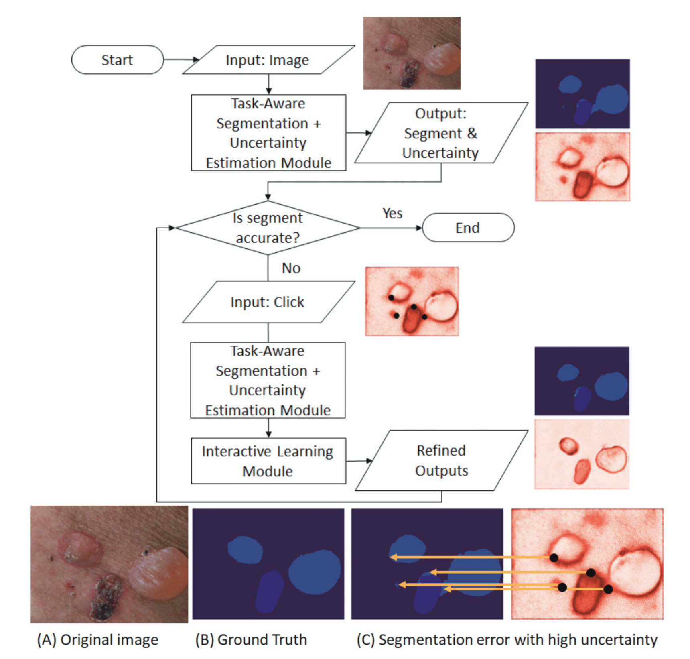
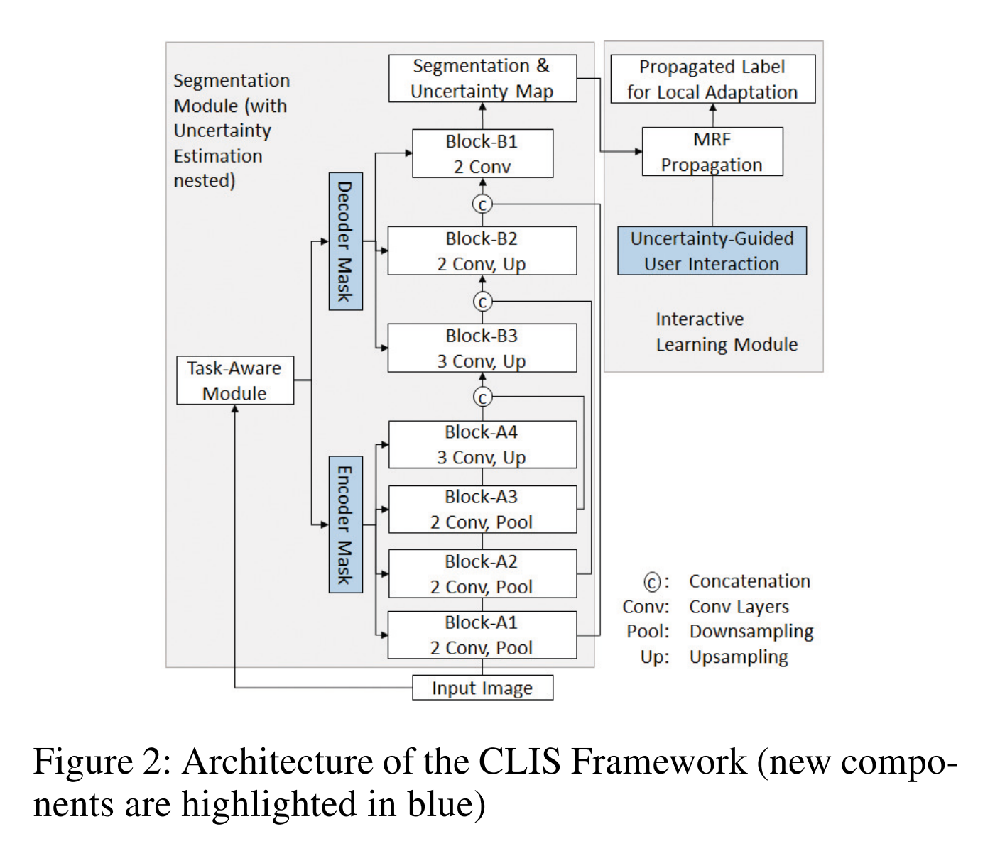

**본 논문은 Rochester Institute of Technology 에서 2021 AAAI 에 발표한 논문입니다.**

## Abstract

---

1. Interactive segmentation offers a solution **<u>by accepting user annotations</u>** on selective areas of the images **<u>to refine the segmentation results</u>**
2. In this work, we **<u>formulate interactive image segmentation as a continual learning problem</u>** and propose a framework to effectively learn from user annotations -> improve the segmentation on both the **current image** and **unseen images** in future tasks
3. (most important) Employs a **<u>probabilistic mask</u>** to **<u>control the neural network's kernel activation</u>** and **<u>extract the most suitable features</u>** for segmenting images in each task
4. Design task-aware architecture to **<u>automatically infer the optimal kernel activation</u>** for initial segmentation and subsequent refinement
5. Extensive experiments are performed on both medical and natural image datasets to illustrate the proposed framework's effectiveness on basic segmentation performance, **forward knowledge transfer**, and **backward knowledge transfer.**

---

## Introduction

---

1. Continual Learning framework for Interactive Segmentation (CLIS) 

   

2. Model 은 총 3가지 modules 로 구성되어 있습니다. (그리고 결과가 user 에게 acceptable 해질때 까지 refine 됩니다)
   1. Task-aware segmentation module
      1. Infers a binary mask that activates a subset of the convolutional kernels to extract the most suitable features for segmentation in each task
   2. Uncertainty estimation module
      1. Generates a map that visualizes the model's uncertainty on its prediction
   3. Interactive learning module
      1. Propagates from user annotations to other pixels and updates the network
         
3. 3 Major Contributions of this paper
   1. Interactive segmentation 문제를 continual learning problem 으로 접근하여 해결한 것, 그리고 basic performance (현재 image), forward (unseen future image) / backward knowledge (previous image) transfer 를 고려한 evaluation protocol 을 디자인 했습니다.
   2. Task-aware segmentation framework with a binary mask 로 부터 활성화 되는 convolution kernel 들을 사용하여 각 task 에 가장 적절한 feature 를 추출했습니다.
   3. Uncertainty map 들을 사용하여 사용자들에게 informative guidance 를 주고, 또한 최소한의 노력으로 segmentation accuracy 를 향상시킬 수 있는 효과적인 방법을 제시했습니다.

## Related Works

---

#### Continual Learning

1. Continual learning 은 previously learned knowledge 를 유지한 채로 시간이 지남에 따라서 새로운 지식을 encoding 하여 모델을 학습시키는 방식이다. Catastrophic forgetting 이 continual-learning 에서 오랜 기간 issue 였습니다. 기존에 이러한 문제를 해결하기 위해 제시되었던 세 가지 방식은 regularization, isolation, 그리고 rehearsal 방식이 있습니다.

#### Interactive Segmentation

1. Interactive segmentation 은 사용자로 하여금 click, bounding box, extreme points 와 같은 방식으로 label 을 수정할 수 있게 합니다.
2. Interactive segmentation (User interaction) 을 진행하기 전에 model 들은 먼저 hold-out labeled dataset 을 활용하여 pre-training 되어야 한다. 이후, 대부분의 model 들은 segmentation refinement 를 위한 post-processing 을 진행하게 되는데, 이 때 conditional random field (CRF) 혹은 graph cuts 과 같은 spatial regularization 방법들을 사용합니다.

#### Uncertainty Estimation

1. Bayesian convolutional network 와 같은 방식이 semantic segmentation 에서 uncertainty estimation 하는데에 많이 사용된다. 하지만, integrating uncertainty with deep learning-based interactive segmentation 은 아직 under-explored 되어 있습니다.

본 논문에서 제시하는 framework 는 continual learning, interactive segmentation 뿐 아니라 **active learning** 그리고 **online learning** 과도 관련이 있습니다.

## The Framework of Continual Learning for Interactive Segmentation

---

CLIS (**C**ontinual **L**earning for **I**nteractive **S**egmentation) framework 에 대한 설명을 이어나갑니다.

#### Overview of the Architecture

### Task Formulation for Interactive Segmentation

### Continual Knowledge Learning through Bayesian Nonparametric Modeling

### Variational Inference

### Predicting Initial Segmentation

### Interactive Segmentation

#### Uncertainty Estimation

#### Propagating User Annotations

#### Learning from User Annotations

## Experiments

---

#### Experimental setup

#### Comparison baselines and evaluation metrics

#### Performance comparison

#### Interpretability

---

## Conclusion

1. 본 논문에서는 Interactive segmentation task 를 continual-learning problem 으로 해결하려고 하였고, segmentation problem 에서 이전 task 에서 발생하는 catastrophic forgetting 을 방지해주는 framework 을 제안하였다.
2. Uncertainty information 을 활용하여 user 들에게 informative guidance 를 해줌으로써 segmentation annotation 을 위한 최소한의 노력을 들일 수 있도록 할 수 있다.
3. 현재 interaction 이 click 으로 한정되어 있는데 scribble, boxes 등으로 확장하여 향후 연구 방향을 설정할 수 있다.
4. (논문이 쓰여질 당시 SOTA) ImageNet 에서 ResNet-50 을 기반으로 한 linear evaluation protocol 에서 SOTA 성능을 보여주었으며, ResNet-200 을 사용했을 때 기존 sota 모델 대비 30% 적은 수의 parameter 를 사용하고도 top-1 accuracy 79.6% 의 성능을 보여줬습니다. (기존 성능 76.8%)
5. 그럼에도 불구하고, BYOL 은 vision task 에서만 사용될 수 있는 augmentation 방식을 채택하고 있습니다. BYOL 이 일반적으로 사용될 수 있으려면 다른 modalities 들 (audio, video, text etc.) 에서도 통용되는 augmentation 방식들도 사용해볼 필요가 있습니다. 하지만 적절한 augmentation 방식들을 searching 하는 것은 많은 노력이 필요하기 때문에 이를 자동화 하여 augmentation 을 searching 하는 방식을 찾는 것이 중요하다고 말하고 있습니다.

