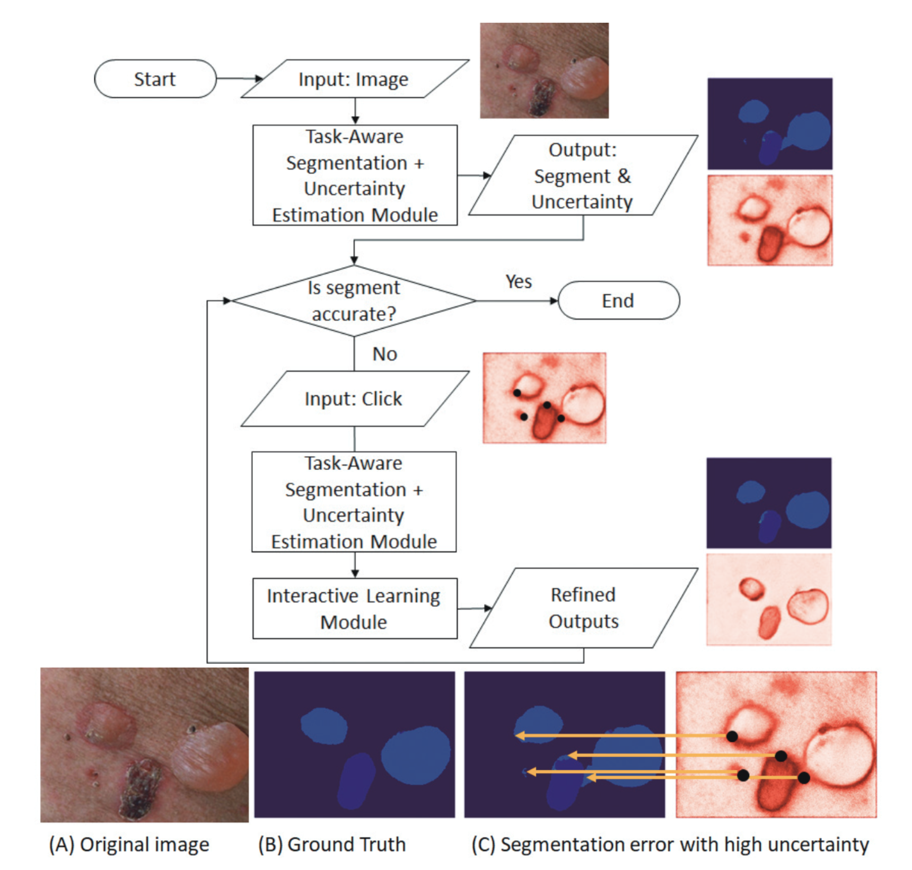

**본 논문은 Rochester Institute of Technology 에서 2021 AAAI 에 발표한 논문입니다.**

## Abstract

---

1. Interactive segmentation offers a solution **<u>by accepting user annotations</u>** on selective areas of the images **<u>to refine the segmentation results</u>**
2. In this work, we **<u>formulate interactive image segmentation as a continual learning problem</u>** and propose a framework to effectively learn from user annotations -> improve the segmentation on both the **current image** and **unseen images** in future tasks
3. (most important) Employs a **<u>probabilistic mask</u>** to **<u>control the neural network's kernel activation</u>** and **<u>extract the most suitable features</u>** for segmenting images in each task
4. Design task-aware architecture to **<u>automatically infer the optimal kernel activation</u>** for initial segmentation and subsequent refinement
5. Extensive experiments are performed on both medical and natural image datasets to illustrate the proposed framework's effectiveness on basic segmentation performance, **forward knowledge transfer**, and **backward knowledge transfer.**

---

## Introduction

---

1. Continual Learning framework for Interactive Segmentation (CLIS) 

   

2. Model 은 총 3가지 modules 로 구성되어 있습니다. (그리고 결과가 user 에게 acceptable 해질때 까지 refine 됩니다)
   1. Task-aware segmentation module
      1. Infers a binary mask that activates a subset of the convolutional kernels to extract the most suitable features for segmentation in each task
   2. Uncertainty estimation module
      1. Generates a map that visualizes the model's uncertainty on its prediction
   3. Interactive learning module
      1. Propagates from user annotations to other pixels and updates the network
   
3. 3 Major Contributions of this paper
   1. Interactive segmentation 문제를 continual learning problem 으로 접근하여 해결한 것, 그리고 basic performance (현재 image), forward (unseen future image) / backward knowledge (previous image) transfer 를 고려한 evaluation protocol 을 디자인 했습니다.
   2. Task-aware segmentation framework with a binary mask 로 부터 활성화 되는 convolution kernel 들을 사용하여 각 task 에 가장 적절한 feature 를 추출했습니다.
   3. Uncertainty map 들을 사용하여 사용자들에게 informative guidance 를 주고, 또한 최소한의 노력으로 segmentation accuracy 를 향상시킬 수 있는 효과적인 방법을 제시했습니다.

## Related Works

---

#### Continual Learning

1. Continual learning 은 previously learned knowledge 를 유지한 채로 시간이 지남에 따라서 새로운 지식을 encoding 하여 모델을 학습시키는 방식이다. Catastrophic forgetting 이 continual-learning 에서 오랜 기간 issue 였습니다. 기존에 이러한 문제를 해결하기 위해 제시되었던 세 가지 방식은 regularization, isolation, 그리고 rehearsal 방식이 있습니다.

#### Interactive Segmentation

1. Interactive segmentation 은 사용자로 하여금 click, bounding box, extreme points 와 같은 방식으로 label 을 수정할 수 있게 합니다.
2. Interactive segmentation (User interaction) 을 진행하기 전에 model 들은 먼저 hold-out labeled dataset 을 활용하여 pre-training 되어야 한다. 이후, 대부분의 model 들은 segmentation refinement 를 위한 post-processing 을 진행하게 되는데, 이 때 conditional random field (CRF) 혹은 graph cuts 과 같은 spatial regularization 방법들을 사용합니다.

#### Uncertainty Estimation

1. Bayesian convolutional network 와 같은 방식이 semantic segmentation 에서 uncertainty estimation 하는데에 많이 사용된다. 하지만, integrating uncertainty with deep learning-based interactive segmentation 은 아직 under-explored 되어 있습니다.

본 논문에서 제시하는 framework 는 continual learning, interactive segmentation 뿐 아니라 **active learning** 그리고 **online learning** 과도 관련이 있습니다.

## The Framework of Continual Learning for Interactive Segmentation

---

CLIS (**C**ontinual **L**earning for **I**nteractive **S**egmentation) framework 에 대한 설명을 이어나갑니다.

#### Overview of the Architecture

1. Segmentation 모듈은 Encoder - Decoder Network 로 이뤄져 있습니다. 추가적으로 Figure2 에 나와있는 것 처럼 Continual learning, Interactive Segmentation 을 위한 additional 구조가 들어가 있습니다. 
2. 현재 task 의 update 는 이전 지식을 Bayesian nonparametric modeling 을 활용하여 probabilistic prior 로 적용하였습니다. 즉 이전 task 의 지식을 현재 task 에 적용하였다고 생각할 수 있습니다. 이를 위해 encoder, decoder 에 있는 convolution kenel activation 에 mask 를 binary mask 를 적용하는 방식을 채택했습니다. Task-aware module 이 각 task 에 맞는 최적의 mask 를 extract 합니다. 
3. Uncertainty estimation module 들이 Block A1-A4, B1-B3 에 결합되어 있고, input image 가 이 block 들을 통과하면서 나오는 uncertainty map 이 user annotation 을 guide 하게 됩니다. 
4. Interactive Learning module 은 Markov Random Field (MRF) 로 부터 영감을 받아 구성되었고 user annotation 을 unannotated pixel 들에 propagate 되어 최종적으로 customized energy function 을 최소화 하게 됩니다. 

### Task Formulation for Interactive Segmentation

1. 먼저 hold-out dataset (interactive segmentation 에 참여하지 않는 dataset) 으로 pre-training 을 진행합니다. 그리고 Continual learning framework 을 구성하기 위해 총 t 번의 user annotation 이 진행됩니다.
2. Interactive segmentation 의 성능을 평가하기 위해 총 3가지 측면에서 분석을 진행합니다. Basic performance, forward knowledge transfer,  그리고 backward knowledge transfer 입니다. 
   1. Basic performance: 현재 image 의 segmentation 의 성능을 얼마나 향상 시킬 수 있는지
   2. Forward knowledge transfer: model 이 user annotation 을 통해 얼마나 unseen image 들에 대해 성능이 향상되는지
   3. Backward knowledge transfer: model 이 user annotation 을 통해 이전 영상들에 대한 성능이 악화되는 것을 방지하는지

### Interactive Segmentation

1. 본 논문에서 제안한 framework 는 important uncertainty information 을 user 에게 직접 제공하여 segmentation map 에서 가장 정보량이 많은 부분들을 annotation 하게 함으로써 annotation effort 를 줄일 수 있습니다.

#### Uncertainty Estimation

1. CLIS 는 Monte-Carlo sampling with pixel-wise variance estimation 을 통해 uncertainty map 을 제공합니다. 이 방식은 uncertainty 를 두 가지로 나눠 (epistemic, aleatoric) 분석합니다. 
   1. Epistemic uncertainty 는 MC sampling 을 통해 나온 수 많은 결과로 variance 를 측정합니다.
   2. Aleatoric uncertainty 는 softmax 이전, decoder 의 마지막 layer 에 head 를 추가하여 variance 를 측정합니다. 
2. 최종 uncertainty 는 아래와 같이 구해집니다.

 

#### Propagating User Annotations

1. Uncertainty map 이 user 에게 제공되면, user 들은 high-uncertainty area 에 집중하여 annotation 하게 guide 됩니다. 
2. Annotation 이후에 user annotation 은 updated segmentation map 을 생성하기 위해 propagation 됩니다. 

## Experiments

---

#### Datasets

1. Pascal VOC challenge - 2,913 images with 21 semantic classes (Randomly select 20% for pre-training)
2. Cityscapes - 5,000 frames with 8 semantic categories (Randomly select 20% for pre-training)
3. Skin dataset - 255 images, each image with multiclass segmentation categories
   1. macuels, papules, plaques, nodules, etc.
   2. 80% of dataset (204 images) for pre-training.

4. Data augmentation 
   1. horizontal flipping
   2. random shifting
   3. rotation

#### Experimental setup

1. 총 3개의 dataset 을 활용하여 20 개의 task sequence 를 만들고, 각 task 에는 8개의 consecutive tasks 가 있다. 각각의 task 에서는 random 하게 하나의 image 를 sample 하여 직접 고안한 user annotation simulation framework 로 실험을 진행합니다.
2. segmentation 결과가 나오게 되면 uncertainty 가 높은 순서대로 총 16개의 erroneous area 들이 선택되고 annotation 된다. 그 뒤에 새롭게 annotation 된 (generate 된) segmentation label 을 기반으로 모델이 update 됩니다.
   1. basic performance 측정 - 2 iteration
   2. forward transfer performance 측정 - 4 iteration
   3. backward transfer performance 측정 - 8 iteration
3. User annotation 을 수행할 때 inter-variability 를 감소시키고 효율적인 annotation 을 위해 SLIC (super-pixel algorithm) 을 활용합니다.

#### Comparison baselines and evaluation metrics

1. 비교 실험을 위해 LwF, EWC, PackNet 의 성능을 보여줍니다.
   1. LwF, EWC 는 additional loss-term 을 추가하여 consolidated knowledge 를 보존하는 대표적인 regularization-based approach 입니다.
   2. PackNet 은 서로 다른 task 에 서로 다른 neuron 을 할당하는 network-pruning 을 방식을 사용하는 isolation-based approach 입니다.

#### Performance comparison

#### Interpretability

1. Layer-wise binary mask 를 활용하여 kernel activation 을 조절하기 때문에 이는 CLIS 의 interpretability 를 높입니다. 이를 아래 Figure 4 에서 확인할 수 있습니다. 두 개의 다른 task 에서 kernel activation 을 visualization 하였는데 특정 kernel 의 특정 pixel 이 plaque 와 관련된 것을 확인할 수 있습니다.

---

## Conclusion

1. 본 논문에서는 Interactive segmentation task 를 continual-learning problem 으로 해결하려고 하였고, segmentation problem 에서 이전 task 에서 발생하는 catastrophic forgetting 을 방지해주는 framework 을 제안하였습니다.
2. Uncertainty information 을 활용하여 user 들에게 informative guidance 를 해줌으로써 segmentation annotation 을 위한 최소한의 노력을 들일 수 있도록 할 수 있습니다.
3. 현재 interaction 이 click 으로 한정되어 있는데 scribble, boxes 등으로 확장하여 향후 연구 방향을 설정할 수 있습니다.
4. (논문이 쓰여질 당시 SOTA) ImageNet 에서 ResNet-50 을 기반으로 한 linear evaluation protocol 에서 SOTA 성능을 보여주었으며, ResNet-200 을 사용했을 때 기존 sota 모델 대비 30% 적은 수의 parameter 를 사용하고도 top-1 accuracy 79.6% 의 성능을 보여줬습니다. (기존 성능 76.8%)
5. 그럼에도 불구하고, BYOL 은 vision task 에서만 사용될 수 있는 augmentation 방식을 채택하고 있습니다. BYOL 이 일반적으로 사용될 수 있으려면 다른 modalities 들 (audio, video, text etc.) 에서도 통용되는 augmentation 방식들도 사용해볼 필요가 있습니다. 하지만 적절한 augmentation 방식들을 searching 하는 것은 많은 노력이 필요하기 때문에 이를 자동화 하여 augmentation 을 searching 하는 방식을 찾는 것이 중요하다고 말하고 있습니다.

