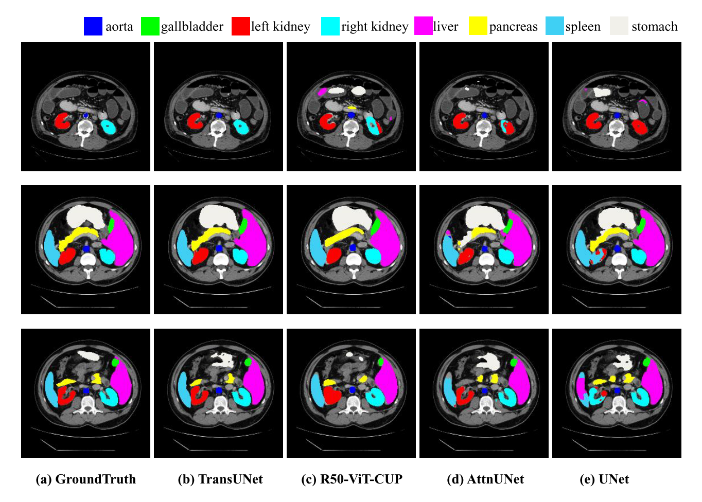

**본 논문은 Johns Hopkins University 에서 arxiv:2102.04306v1 에 발표한 논문입니다.**

## Abstract

---

1. Transfomers 는 innate global self-attention mechanism 을 활용하여 CNN 을 대체할 수 있는 하나의 모델 구조로 인식되어 왔습니다. 하지만 CNN 구조에 비해 limited localization abilities 를 보입니다.
2. 본 논문에서는 TransUNet 모델 구조를 제안하는데, 이 모델 구조는 Transformer 와 CNN 기반의 U-Net 구조의 이점을 모두 살려서 medical image segmentation task 를 수행합니다.
   1. Transformer 는 CNN 을 통과한 feature map 들을 input sequence 로 받아서 encoding 하여 global context 를 잡아냅니다.
   2. Decoder 구조에서의 CNN은 encoded 된 feature 들을 high-resolution CNN feature map 과 결합하여 precise localization 이 가능하게 합니다.
3. 본 논문에서는 TransUNet 을 여러 medical image segmentation task 에 적용하고, 이를 통해 U-Net 과 Transformer 의 결합이 localized spatial information 들을 보존하여 finer detail 을 detect 하는 것을 보여줍니다. 본 논문의 코드는 [github 링크](https://github.com/Beckschen/TransUNet)에서 확인할 수 있습니다.

## Related Work

---

#### Combining CNNs with self-attention mechanisms

1. Before deep learning, interactive segmentation was usually posed as an optimization problem.
2. Optimization algorithm is applied to the **cost function that enforces pixels of the same segment to have the same label in the resulting segmentation masks**.
3. Optimization-based methods usually demonstrate **predictable behaviour** and allow obtaining detailed segmentation masks with enough user input.
4. This requires **additional user effort to obtain accrate object masks for known objects** compared to recently proposed learning-based methods.

#### Transformers

1. The first deep learning-based interactive segmentation method **calculate distance maps from positive and negative clicks**, **stack them together with an input image and pass into a network that predicts an object mask**.
2. The common problem of deep learning-based methods for interactive segmentation is **overweighting semantics** and **making little use of user-provided clicks**.

---

본 논문에서 제시한 TransUNet 은 Transformer-based medical image segmentation 의 첫 시도이며 이는 ViT의 성공에서 고안해 냈다고 말하고 있습니다.

## Method

---

TransUNet 은 encoder 부분에 self-attention mechanism 이 들어간 Transformer embedding 이 있다는 것이 기존 연구와의 차별점입니다. 먼저 decomposed image patches 로 부터 transformer encoder 를 적용하여 feature representation 을 뽑아내는 것을 보여주고, 그 다음 구체적인 TransUNet 전체 구조를 설명합니다.

### Transformer as Encoder

1. **Image Sequentialization**:  먼저 기존 다른 Transformer 와 동일하게  P*P 의 patch 를 N 개 생성합니다.

2. **Patch Embedding**: Vectorized patches $x_p$ 를 latent D-dimensional space 로 linear projection 을 수행합니다. 또 patch spatial information 을 추가하여 positional information 도 추가합니다.

   1. Transformer Encoder 는 L 개의 Multihead Self-Attention (MSA) 와 Multi-Layer Perceptron (MLP) block 들로 이루어져 있습니다. 따라서 $l$ layer 에서의 output 은 다음과 같습니다.

      $z'_l = MSA(LN(z_{l-1})) + z_{l-1} $

      $z_l = MLP(LN(z'_l)) + z'_l $

   2. 여기서 LN 은 Layer Normalization 연산자 이고 $z_l$ 은 encoded image representation 입니다.

### TransUNet

1. Segmentation task 를 수행하기 위해 첫 시도는 Transformer encoder 를 통과하고 나온 encoded feature representation 들을 upsample 하여 dense output 을 예측하는 것이었습니다. 
2. 먼저 encoded feature 는 $HW/P^2$ 에서 $H/P$ x $W/P$ 로 reshape 되어야 합니다. 여기서 class number 를 맞춰주기 위해 1x1 convolution 을 진행합니다. 하지만 곧바로 Upsampling 하는 것 (naive upsamling) 은 Transformer 의 optimal usage 가 아니기 때문에, 이럴 경우 low-level detail 에 대한 loss 가 생기게 됩니다. 이러한 이유로 Cascaded Upsampling 을 사용합니다.

---

- Cascaded Upsampler

1. Hidden feature 를 multiple upsampling step 들을 활용하여 $H/P$ x $W/P$ 에서 full-resolution 인 $H$x$W$ 로 변환합니다. 2x upsampling operator, 그리고 3x3 convolution layer, 그리고 ReLU 로 구성되어 있습니다.

## Experiments and Discussion

---

### Dataset and Evaluation

1. Synapse multi-organ segmentation dataset 
   1. MICCAI 2015 Multi-Atlas Abdomen Labeling Challenge
      1. 30 samples abdominal CT scans (18 / 12 for train / val)
      2. 3,779 axial contrast-enhanced abdominal CT images
   2. 각 CT volume 은 85~198 slides, 512 x 512 pixel 로 구성되어 있습니다.
   3. 총 8개의 abdominal organ 들에 대한 Dice score coefficient 와 Hausdorff Distance (HD) 를 계산하였습니다.
2. Automated cardiac diagnosis challenge (ACDC)
   1. Cine MRI 영상들이고, 각 환자 영상들에 대한 annotation 은 left ventricle, right ventricle, 그리고 myocardium 에 대해서 진행됐습니다. 
   2. Randomly split 70 training case (1,930 axial slices) 에 대한 결과를 확인했습니다 (10 / 20 valid / test)

### Visaulizations

### Generalization to Other Datasets

1. TransUNet 의 generalization ability 를 보여주기 위해 서로 다른 imaging modalities 들에 대해 evaluation 을 진행했습니다. ($i.e.,$ CT, MRI)
2. TransUNet 이 CNN-based method (R50-UNet and R50-AttnUNet) 에 비해 성능 향상이 있는 것을 확인했고 더욱이 다른 Transformer based method (ViT-CUP and R50-ViT-CUP) 에 비해서도 성능 향상을 보이는 것을 확인했습니다. 
3. 이 결과는 Synapse CT dataset 과 동일한 trend 를 보입니다.

## Conclusion

---

1. 본 논문에서는 Transformers 를 medical image segmentation task 에서 활용했고, Transformer 구조의 이점을 최대한 살리기 위해 global context 에 대한 정보만 추출한 것이 아니라 low-level CNN faeture 과 U-shpaed skip connection 을 통해 hybrid architectural design 을 고안해냈습니다.
2. FCN-based 방식들에 비해서 TransUNet 은 좋은 성능을 보였으며, 더욱이 CNN-based self-attention method 들 보다도 더 좋은 성능을 보였습니다.

